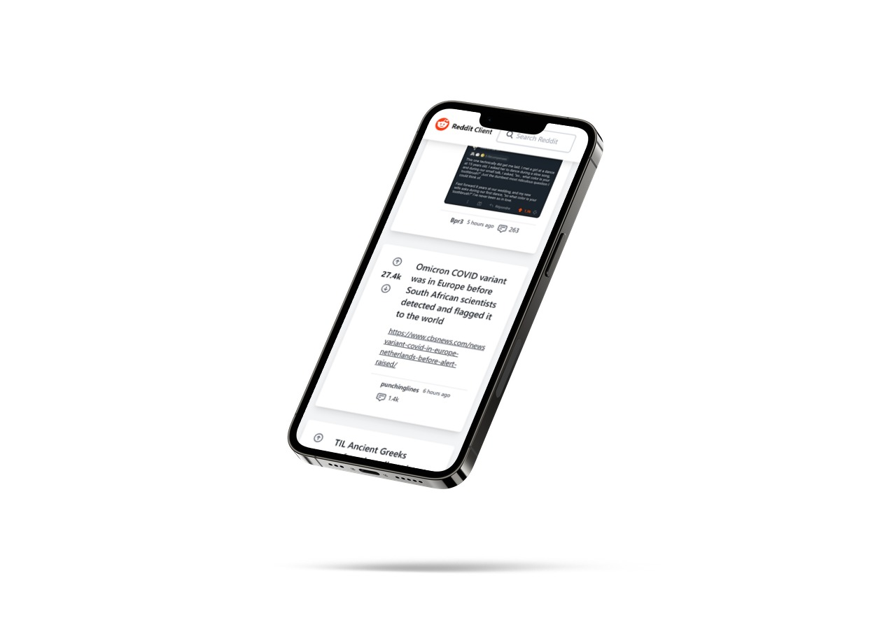
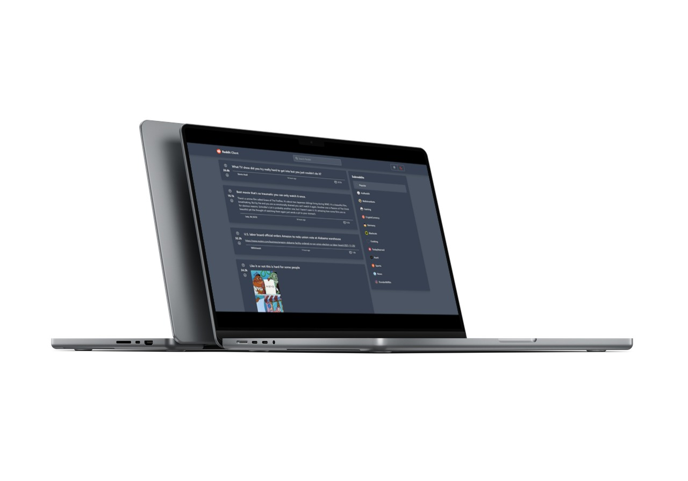

# Reddit client - A simple frontend for some popular subreddits

This is a simplified frontend for [Reddit](https://www.reddit.com), a website where people share links to articles, media and other things on the web. It uses the Reddit JSON API to get the content. It serves as an example project to get more practice in the various techniques and frameworks that have been used.

## Table of contents

- [Overview](#overview)
  - [The challenge](#the-challenge)
  - [Screenshots](#screenshots)
  - [Links](#links)
- [The project](#the-project)
  - [Built with](#built-with)
  - [Features](#features)
  - [Future work](#future-work)
- [Author](#author)

## Overview

### The challenge

This project had the following requirements:

- Build the application using React and Redux
- Version control your application with Git and host the repository on GitHub
- Use a project management tool (GitHub Projects, Trello, etc.) to plan your work
- Write a README (using Markdown) that documents your project including:
- Write unit tests for your components using Jest and Enzyme
- Write end-to-end tests for your application
- Users can use the application on any device (desktop to mobile)
- Users can use the application on any modern browser
- Users can access your application at a URL
- Users see an initial view of the data when first visiting the app
- Users can search the data using terms
- Users can filter the data based on categories that are predefined
- Users are shown a detail view (modal or new page/route) when they select an item
- Users are delighted with a cohesive design system
- Users are delighted with animations and transitions
- Users are able to leave an error state
- Get 90+ scores on Lighthouse

### Screenshots

**Mobile version**

**Desktop version**

### Links

- Solution URL: [https://github.com/YannikS14/reddit-client](https://github.com/YannikS14/reddit-client)
- Live Site URL: [https://yanniks14.github.io/reddit-client/](https://yanniks14.github.io/reddit-client/)

## The project

### Built with

- [tailwindcss](https://tailwindcss.com/) - CSS Framework
- [React](https://reactjs.org/) - JS library
- [Redux](https://redux.js.org/) - State Management
- [React Redux](https://react-redux.js.org/) - React bindings for Redux
- [Redux Toolkit](https://redux-toolkit.js.org/) - Tools for efficient Redux development
- [Jest](https://jestjs.io/) - Testrunner for Unit- & Integration-tests
- [React Testing Library](https://testing-library.com/docs/react-testing-library/intro/) - Test utility
- [Cypress](https://www.cypress.io/) - Testrunner for End2End-tests (for this project)

### Features

This reddit client offers a modern layout that is accessible from mobile and desktop devices with all modern browsers. The application is implemented as a single page app (SPA), being based on React. The achieved testing code coverage of 100% ensures high code quality, which can be automatically tested via the provided unit, snapshot, integration, and end-to-end tests. Performance and accessibility aspects have also been considered during development, which lead to high scores in the Chrome Lighthouse tests (70-95 points for Performance (depending on the served post content), 100 points for Accessibility, 100 points for Best Practices).

The user can choose from 13 predefined subreddits of varying categories. For each subreddit, the latest 25 posts are displayed. The displayed post content contains meta data like a title, the author, the publishing data, comments and upvotes aswell as the actual content in either textual form (displayed with a markdown renderer) or a picture, video or link.

It is possible to filter the posts of a subreddit with the given search box. By clicking on the title of a post, the post can be displayed in a focused modal view. Clicking the up- or downvote button simulates submitting a vote for the respective post (Since the Reddit JSON API is read-only, no votes are actually submitted). Clicking the comments icon opens a selection of user comments for the respective post. The user can also choose between a light or dark theme for the reddit client.

### Future work

Some example ideas for further development of this project are:

- Improving the posts image rendering for even better performance
- Including a bigger variety of subreddits or
- Dynamically including all available subreddits
- Switching to the Reddit API instead of JSON API to offer submitting features (votes, posts, comments etc.)
- Getting a custom domain name and using it to publicly host the reddit client
- Setting up a CI/CD workflow to automatically deploy the application
- Making the application a progressive web app

## Author

- Website - [YS-media](https://ys-media.de/)
- Github - [@YannikS14](https://github.com/YannikS14)
